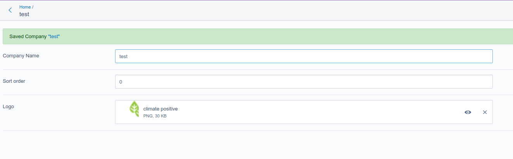
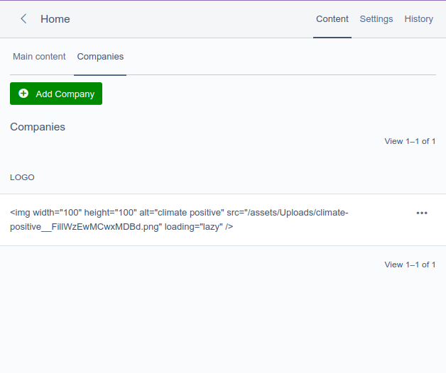

# BUG

See: https://github.com/silverstripe/silverstripe-framework/issues/11200

See composer file for packaged used. 

It seems to me that the summary fields are (double) escaped...

# results in: 

